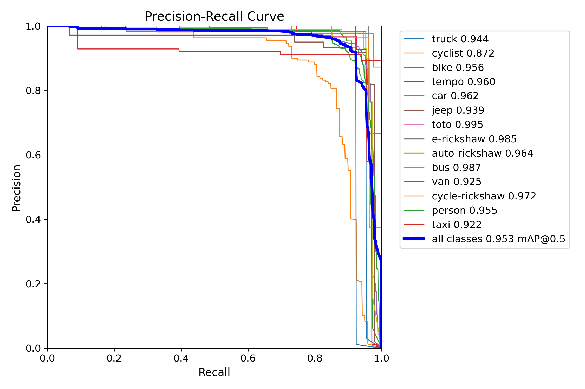
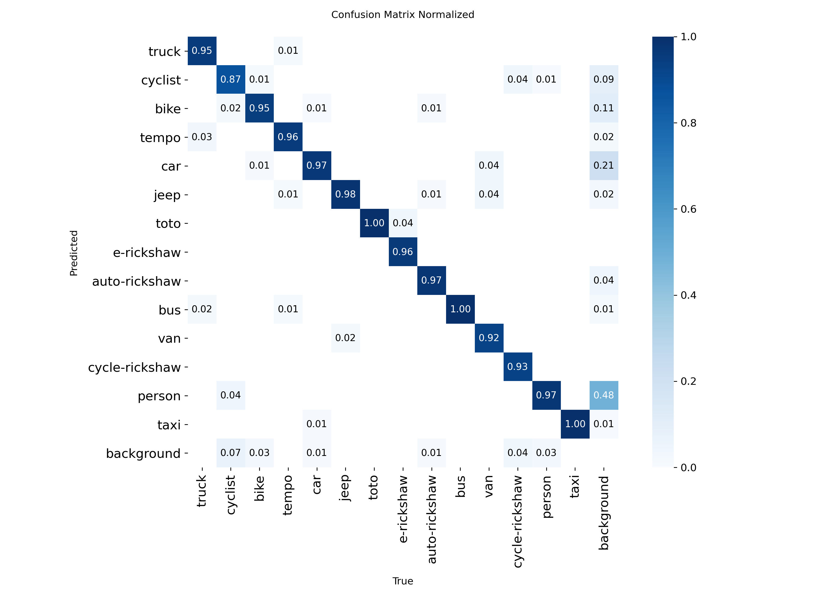
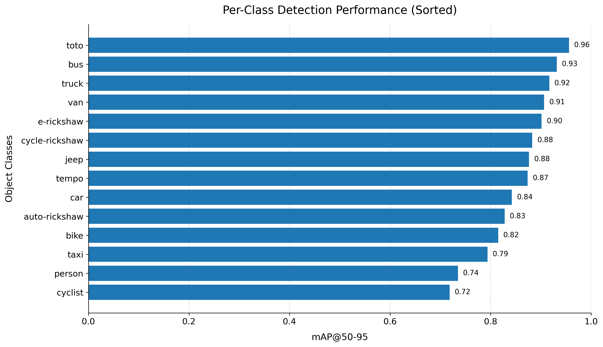
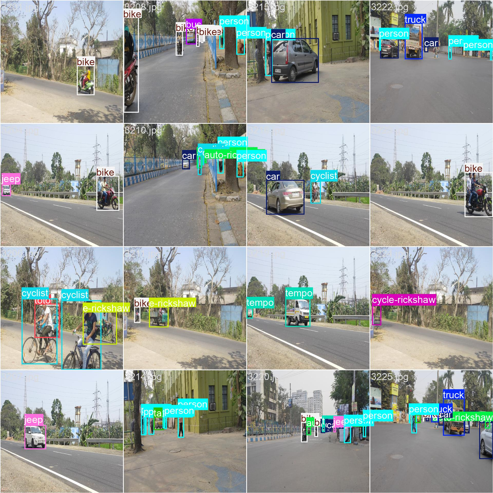
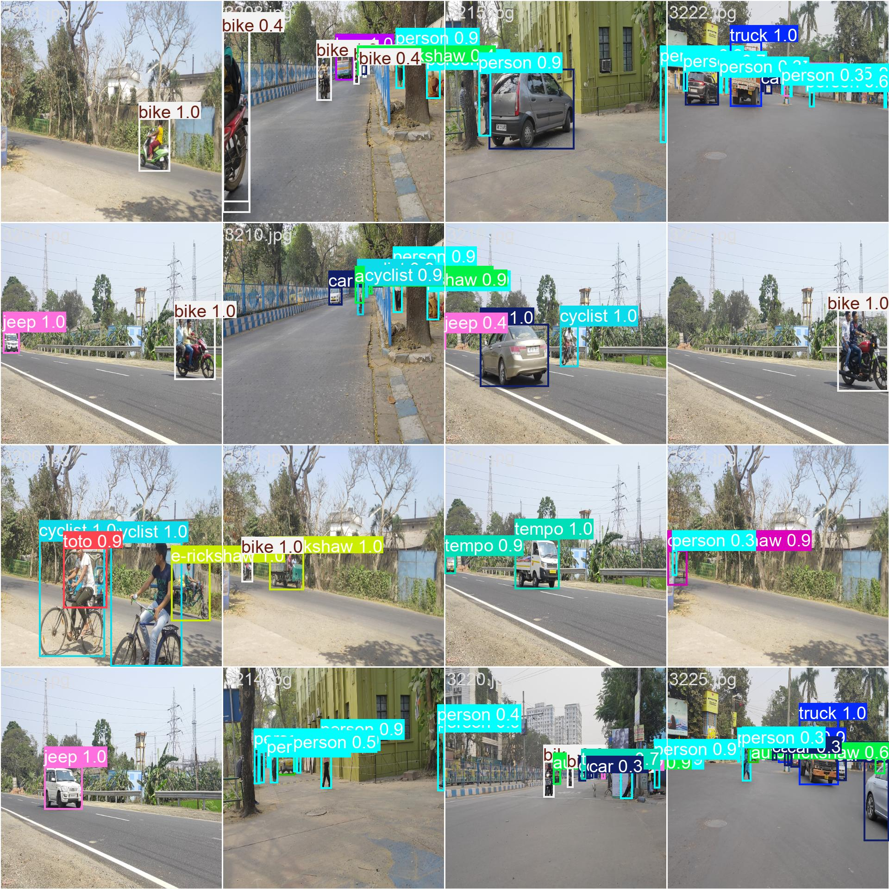

# ARGUS: Traffic Monitoring & Violation Tracking

**Status: Under Development**

ARGUS is an edge-focused traffic monitoring system designed to detect vehicles, license plates, and rider safety violations while maintaining persistent tracking across video streams.  
The project aims to build a modular pipeline capable of running on embedded hardware for real-time traffic observation, enforcement support, and data-driven traffic analytics.

ARGUS combines modern object detection with multi-object tracking to enable continuous monitoring of traffic activity and automated violation logging.

## Core Capabilities

Beyond detection, the system is intended to generate traffic statistics useful for Intelligent Transportation Systems (ITS), such as:

- **Vehicle counts and traffic flow rates**
- **Lane-level traffic density estimation**
- **Vehicle trajectory and movement analysis**
- **Speed estimation and congestion monitoring**
- **Safety violation detection** (e.g., helmet compliance)

These analytics support traffic planning, law enforcement, and urban mobility analysis, enabling smarter infrastructure and more efficient traffic management.

---

## Phase 2 Test Metrics

The model achieves the following performance metrics on the test dataset:

| Metric | Score | Decimal |
| :--- | :--- | :--- |
| **mAP50** | 95.27% | 0.9527 |
| **mAP50-95** | 85.55% | 0.8555 |
| **Precision** | 94.22% | 0.9422 |
| **Recall** | 92.20% | 0.9220 |

### Performance Visualization

The following graphs detail the training and evaluation performance across 14 different classes:

#### Precision-Recall Curve & Confusion Matrix

#### Per-Class Performance

---

## Inference Examples

Sample predictions from the evaluation set demonstrating the model's detection capabilities across different viewpoints and traffic conditions:

